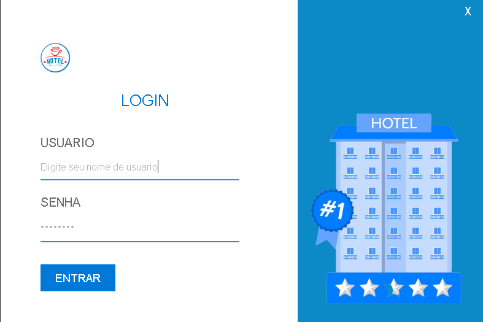
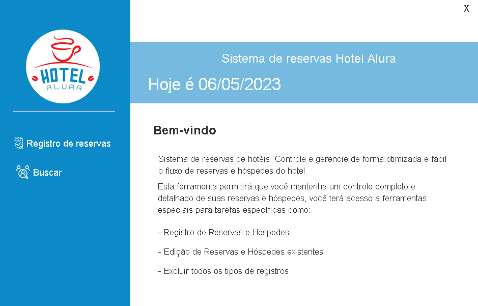
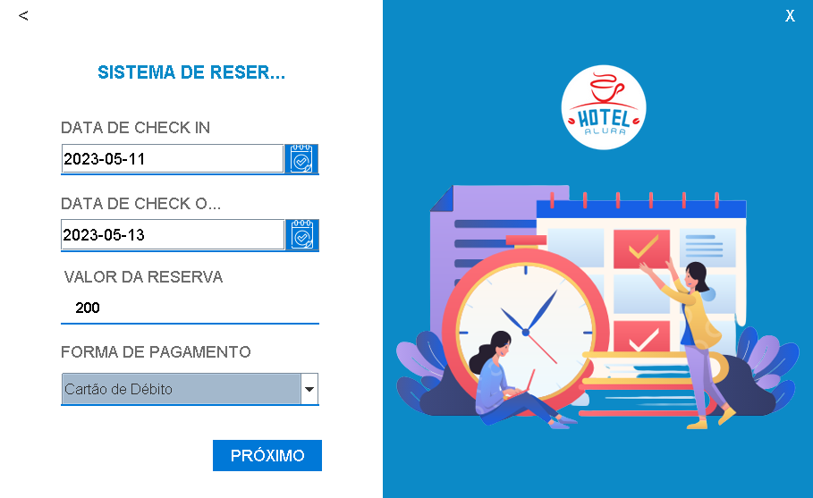
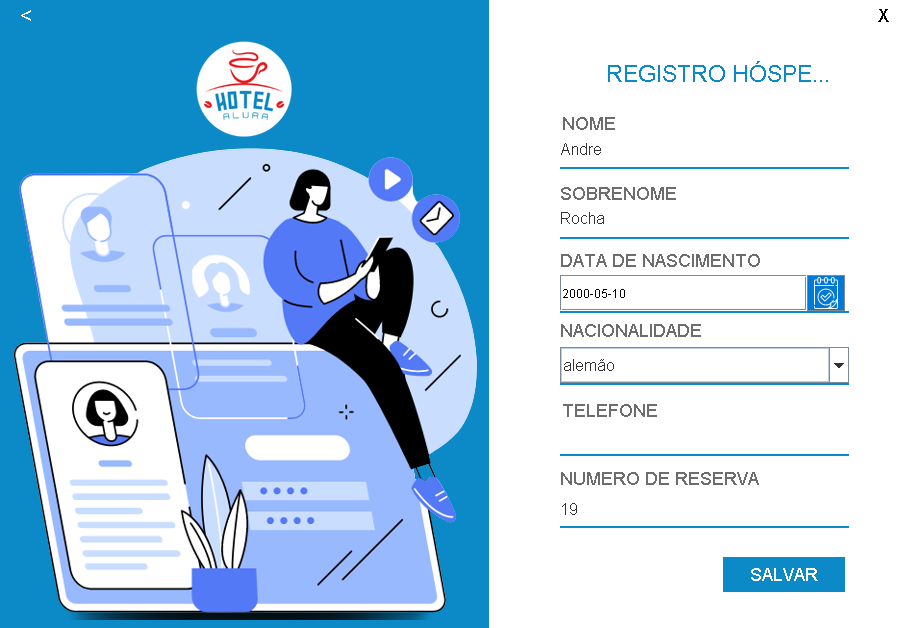
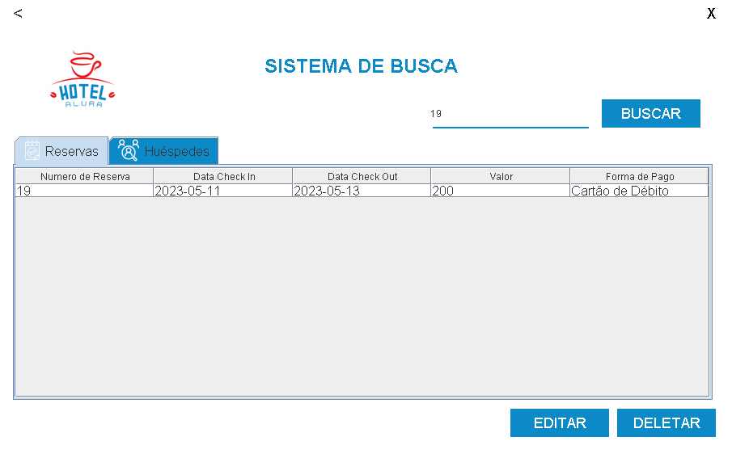
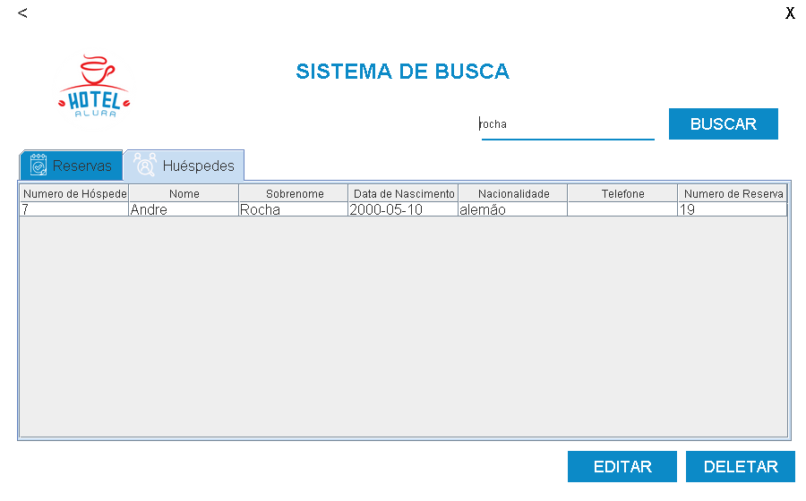

<h1 align="center">Hotel Alura</h3>

---

Gerenciamento das reservas e hóspedes do Hotel
      

## 📝 Menu

- [Sobre](#sobre)
- [Analisando nosso repositório!](#nossoRepositorio)
- [Download](#download)
- [Eclipse](#eclipse)
- [Importante](#importante)
- [Banco de dados](#bd)
- [Screenshots](#screenshots)
- [Tecnologias]("#tecnologias")
- [Autor](#autor)

## 🧐 Sobre 

O sistema de gerenciamento possui as funcionalidades de cadastrar, editar e excluir dados de uma reserva e um hóspede.

## 🔍 Analisando nosso repositório! 

### Este é o repositório base do nosso projeto, nele você encontrará:
#### 🔹 src/views: pasta com toda a interface gráfica das telas necessárias para desenvolver o programa;
#### 🔹 src/imagens: pasta com imagens que você pode utilizar em seu projeto. Sinta-se a vontade para utilizar outras, caso deseje.
 

## ⬇️ Download 

### Como fazer o download: 

#### 🔹 Fork
1 - Faça o <strong>fork</strong> do projeto. No lado superior direito, ao clicar no ícone ele criará um repositório do projeto em sua conta pessoal do GitHub.  

     

 

2 - Após ter o repositório "forkado" para sua conta, verifica se a url da página é a do repositório da sua conta.

     

 

3 - Clique na opção <strong>Code</strong>. Ele apresentará três formas para instalar o repositório em sua máquina, e destacamos duas:

     

 

#### 🔹 Clonar ou baixar o ZIP

1 - Para clonar, basta copiar a <em>url</em> destacada na imagem e localizada logo abaixo do HTTPS, criar uma pasta em seu computador, abrir o <em>cmd</em> ou o <em>git bash</em> dentro dessa pasta e em seguida insira o comando <strong>git clone</strong> e com o botão direito do mouse dentro do terminal clicar na opção <strong>Paste</strong> para colar a <em>url</em> e dar <em>Enter</em>. 

     

 

2 - A segunda opção é baixar o código em um pacote <strong>"zipado"</strong> e extrair a pasta para o seu computador. 
  

## 📝 Eclipse 

### Como importar o meu projeto no Eclipse?

1 - Uma vez dentro do Editor do lado esquerdo, clique em <em>File</em> que está no menu na parte superior, escolha a opção <em>Open Projects from File System</em>.

     

Em seguida, clique em <em>Directory</em> e localize o diretório do projeto "clonado" ou "extraído" em seu computador. Clique em <em>Finish</em> para concluir a importação.

     

2 - A segunda forma de importar está em <em>File</em> na opção <em>Import</em>. Ou através do <strong>Project Explorer</strong>, clique no campo vazio com o botão direito do mouse e escolha a opção <em>Import</em>.

     

     

Se optar pelo <strong>Import</strong>, abrirá a janela correspondente, clique na opção <em>Existing Projects Into Workspace</em> e no botão <em>Next</em>.

     

Em seguida, clique no botão <em>Browse</em> e busque o projeto no diretório local.

     

## ⚠️ Importante! 

☕ Use o Java na versão 8 ou superior para ter compatibilidade. 
  
📝 Recomendamos utilizar o editor Eclipse para compatibilidade da interface gráfica.   
🎨 A interface contém dois importantes métodos:
- setResizable(false): determina o tamanho da janela, e através do parâmetro <strong>false</strong>, a tela não poderá ser maximizada;
- setLocationRelativeTo(null): determina a localização da janela, e através do parâmetro <strong>null</strong> ele a mantém centralizada na tela.

## 📊 Banco de Dados 

## 📸 Screenshots 
<h1 align="center">
  
</h1>
<h1 align="center">
  
</h1>
<h1 align="center">
  
</h1>
<h1 align="center">
  
</h1>
<h1 align="center">
  
</h1>
<h1 align="center">
  
</h1>

## ⛏️ Tecnologias 

- [Java 17](https://www.oracle.com/br/java/) - Linguagem
- [Mysql](https://www.mysql.com/) - Banco de dados
- [Eclipse](https://www.eclipse.org/downloads/) - IDE

## ✍️ Autor 

- [@Andrejmrocha](https://github.com/Andrejmrocha) - Desenvolvimento back-end

